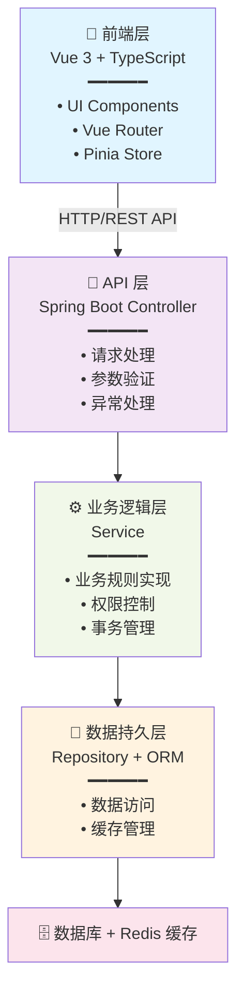
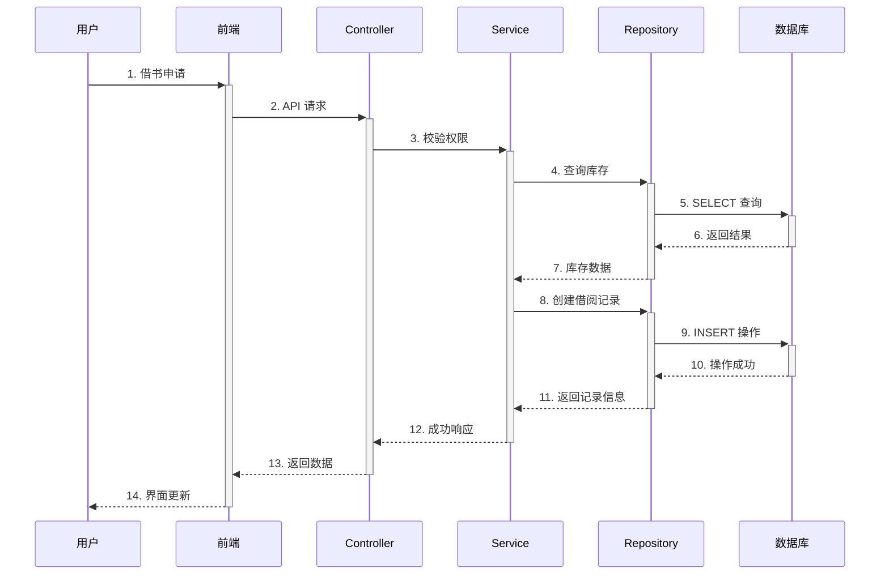
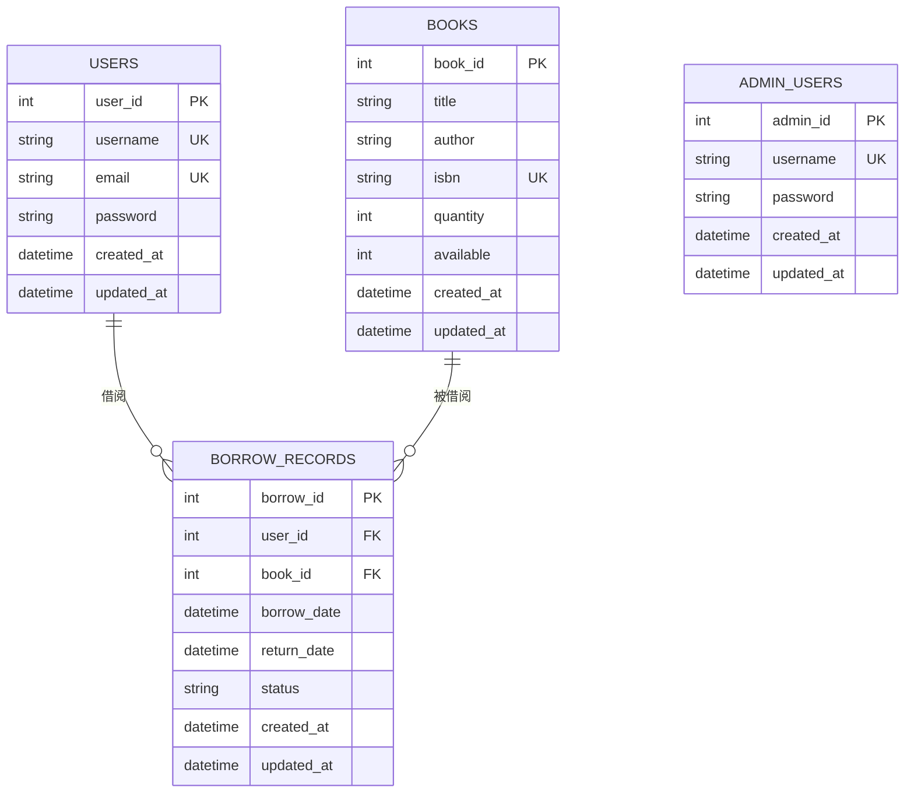

# Library Management System V2

## 1. 系统简介

Library Management System V2 是一个现代化的图书馆管理系统，采用前后端分离架构。该系统提供图书管理、用户认证、借阅管理等核心功能，支持管理员和普通用户两种角色。

**技术栈：**
- **后端：** Java + Spring Boot + Gradle
- **前端：** Vue 3 + TypeScript + Vite
- **数据库：** 支持关系型数据库
- **缓存：** Redis（会话管理）
- **容器化：** Docker + Docker Compose

---

## 2. 系统分析

### 2.1 用例图与主要流程

**主要用户角色：**
- **管理员：** 管理图书、用户、借阅记录等
- **普通用户：** 查看图书、借阅图书、管理个人信息

**主要业务流程：**
1. 用户认证流程：注册 → 登录 → 会话管理
2. 图书管理流程：创建 → 查询 → 编辑 → 删除
3. 借阅管理流程：查询可用图书 → 提交借阅申请 → 审批 → 归还管理

---

## 3. 系统设计

### 3.1 概要设计

#### 3.1.1 系统架构图

系统采用经典的三层架构：



#### 3.1.2 核心类设计

**主要实体类：**
- `User` - 用户信息
- `Book` - 图书信息
- `BorrowRecord` - 借阅记录
- `Admin` - 管理员信息

**主要业务层类：**
- `AuthService` - 认证服务
- `UserService` - 用户管理服务
- `BookService` - 图书管理服务
- `BorrowService` - 借阅管理服务
- `AdminService` - 管理员服务

#### 3.1.3 主要业务时序图

**借阅图书时序：**



### 3.2 数据库设计

#### 3.2.1 ER 图（实体关系模型）



#### 3.2.2 主要数据表结构

**users 表：**
```sql
CREATE TABLE users (
  user_id INT PRIMARY KEY AUTO_INCREMENT,
  username VARCHAR(100) UNIQUE NOT NULL,
  email VARCHAR(100) UNIQUE NOT NULL,
  password VARCHAR(255) NOT NULL,
  created_at TIMESTAMP DEFAULT CURRENT_TIMESTAMP,
  updated_at TIMESTAMP DEFAULT CURRENT_TIMESTAMP ON UPDATE CURRENT_TIMESTAMP
);
```

**books 表：**
```sql
CREATE TABLE books (
  book_id INT PRIMARY KEY AUTO_INCREMENT,
  title VARCHAR(200) NOT NULL,
  author VARCHAR(100) NOT NULL,
  isbn VARCHAR(20) UNIQUE,
  quantity INT NOT NULL DEFAULT 0,
  available INT NOT NULL DEFAULT 0,
  created_at TIMESTAMP DEFAULT CURRENT_TIMESTAMP,
  updated_at TIMESTAMP DEFAULT CURRENT_TIMESTAMP ON UPDATE CURRENT_TIMESTAMP
);
```

**borrow_records 表：**
```sql
CREATE TABLE borrow_records (
  borrow_id INT PRIMARY KEY AUTO_INCREMENT,
  user_id INT NOT NULL,
  book_id INT NOT NULL,
  borrow_date TIMESTAMP DEFAULT CURRENT_TIMESTAMP,
  return_date TIMESTAMP,
  status ENUM('borrowed', 'returned', 'overdue') DEFAULT 'borrowed',
  created_at TIMESTAMP DEFAULT CURRENT_TIMESTAMP,
  updated_at TIMESTAMP DEFAULT CURRENT_TIMESTAMP ON UPDATE CURRENT_TIMESTAMP,
  FOREIGN KEY (user_id) REFERENCES users(user_id),
  FOREIGN KEY (book_id) REFERENCES books(book_id)
);
```

**admin_users 表：**
```sql
CREATE TABLE admin_users (
  admin_id INT PRIMARY KEY AUTO_INCREMENT,
  username VARCHAR(100) UNIQUE NOT NULL,
  password VARCHAR(255) NOT NULL,
  created_at TIMESTAMP DEFAULT CURRENT_TIMESTAMP,
  updated_at TIMESTAMP DEFAULT CURRENT_TIMESTAMP ON UPDATE CURRENT_TIMESTAMP
);
```

---

## 4. 总结

Library Management System V2 是一个功能完整、架构清晰的图书馆管理系统。通过采用现代化的技术栈（Spring Boot + Vue 3）和标准的三层架构设计，系统具有良好的可扩展性和可维护性。

**系统优势：**
- ✅ 前后端分离，易于独立开发和部署
- ✅ 采用 Redis 缓存提升性能
- ✅ Docker 容器化支持快速部署
- ✅ 完善的权限管理和安全认证
- ✅ 清晰的数据库设计和业务逻辑

**后续可扩展方向：**
- 图书推荐算法
- 积分兑换系统
- 消息通知服务
- 报表统计分析
- 性能监控和优化
